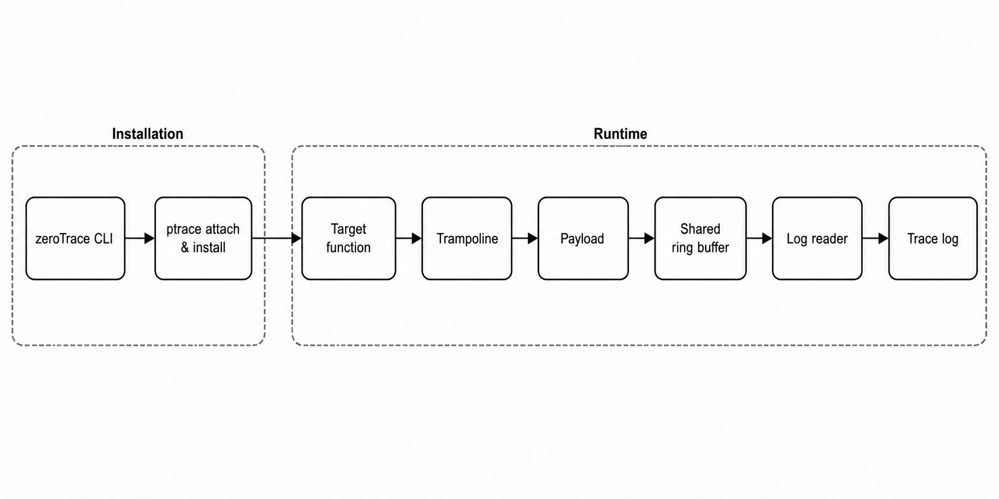

# zeroTrace: A Lightweight Dynamic Probe for User Space

zeroTrace 是一个面向 Linux 的轻量级用户态动态探针工具。它通过 `ptrace` 将 payload 注入目标进程并改写函数入口，使参数采集、返回值捕获和事件写入在目标进程内完成，避免每次探针命中都切换到 tracer 处理。

> [!WARNING]
> zeroTrace 目前处于实验阶段。它会修改运行中进程的指令和执行流，请先在可恢复的测试环境中验证，不要直接用于关键生产负载。

## Features

- 动态附加到已运行的 Linux 进程，无需重新编译目标程序。
- 支持用户态函数的 entry probe 和 return probe。
- 捕获前 6 个整数或指针参数，并支持浮点参数与返回值的格式化。
- 支持 `enable`、`disable` 和 `untrace` 等运行时探针管理操作。
- 支持条件过滤、探针热更新和探针内 call action。
- 支持多探针共存、线程组级 stop/continue 和多线程目标。
- 提供 x86_64 和 aarch64 两套 ISA 后端。
- 输出接近 `perf script` / `ftrace` 的日志，便于按时间戳合流分析。

## Architecture



zeroTrace 的追踪流程分为安装和运行两个阶段：

1. tracer 通过 `ptrace` 附加目标进程，注入 payload，创建 trampoline 并改写函数入口。
2. 探针命中后，目标函数跳转到 trampoline 和进程内 payload，再将事件写入共享 ring buffer。
3. tracer 异步读取 ring buffer，将事件输出到终端和日志文件。

## Repository Layout

| 路径 | 说明 |
| --- | --- |
| `conf/` | 函数签名配置，用于参数和返回值格式化 |
| `include/` | 公共头文件 |
| `scripts/` | benchmark、架构检查和日志合流脚本 |
| `src/` | zeroTrace 主体实现 |
| `src/isa/` | x86_64 和 aarch64 后端 |
| `src/test/` | 自动化测试、benchmark、fixture 和手动演示程序 |
| `assets/` | README 使用的图片资源 |

主要构建产物：

| 路径 | 说明 |
| --- | --- |
| `bin/ztrace` | 交互式 tracer |
| `bin/libzt_payload.so` | 注入目标进程的 payload |
| `bin/tests/test_loop` | 手动演示目标程序 |

## Requirements

zeroTrace 支持 Linux x86_64 和 aarch64，构建时需要：

- GCC 和 GNU Make
- Capstone
- GNU Readline
- Python 3（用于测试和 benchmark 脚本）

Debian / Ubuntu 可使用以下命令安装：

```bash
sudo apt install build-essential libcapstone-dev libreadline-dev python3
```

如需运行 kernel uprobe 对照 benchmark，还需安装 `bpftrace`：

```bash
sudo apt install bpftrace
```

zeroTrace 依赖 `ptrace`。如果 Yama 策略禁止附加，请在了解安全影响后，根据实际环境调整 `/proc/sys/kernel/yama/ptrace_scope`。

## Build

构建当前主机架构：

```bash
make
```

显式选择 ISA 后端：

```bash
make ARCH=x86_64
make ARCH=aarch64
make ARCH=aarch64 CC=aarch64-linux-gnu-gcc
```

清理构建产物：

```bash
make clean
```

## Quick Start

首先启动演示目标：

```bash
./bin/tests/test_loop
```

在另一个终端启动 tracer：

```bash
./bin/ztrace
```

在 zeroTrace CLI 中附加目标进程并添加探针：

```text
attach <pid>
trace add_loop
trace fp_add_loop
```

探针命中后，日志会同时输出到终端和 `ztrace.<pid>.log`：

```text
test_loop-532386/532386 [010] 58915.513461172: ztrace:entry: add_loop(24, 25)
test_loop-532386/532386 [010] 58915.513468205: ztrace:return: add_loop -> 49
test_loop-532386/532386 [010] 58915.513461172: ztrace:entry: fp_add_loop(24.25, 1.5)
test_loop-532386/532386 [010] 58915.513468205: ztrace:return: fp_add_loop -> 25.75
```

完成后卸载探针并退出：

```text
untrace add_loop
untrace fp_add_loop
detach
quit
```

## CLI Commands

zeroTrace 提供交互式命令行，常用命令如下：

```text
help
attach <pid>
detach
trace <symbol>
trace <symbol> if <expr>
update <symbol|id> if <expr>
update <symbol|id> clear
update <symbol|id> call <callee> [arg0|arg1|...|arg5|0x...]
update <symbol|id> call clear
enable <symbol|id>
disable <symbol|id>
disable all
untrace <symbol|id>
info target
info probes
stop
continue
quit
```

条件表达式可使用 `arg0` 到 `arg5`、十进制或十六进制常量、比较运算、算术运算、布尔运算和括号。例如：

```text
trace write if arg0 == 1 && arg2 > 0
```

探针可通过函数名或 `info probes` 显示的 ID 管理。

## Function Signatures

[`conf/zttrace.conf`](./conf/zttrace.conf) 用于描述函数签名。当探针命中已配置的函数时，zeroTrace 会按参数名和类型格式化输出。

配置格式：

```text
function_name(arg_type arg_name, arg_type arg_name, ...) -> return_type
```

示例：

```text
read(int fd, buffer buf, size_t count) -> long
write(int fd, const buffer buf, size_t count) -> long
printf(const char *fmt, ...) -> int
fp_add_loop(double a, double b) -> double
```

未配置的函数会回退到原始寄存器风格的参数展示。

## Test

运行自动化测试：

```bash
make test
```

测试覆盖探针生命周期、参数与返回值、动态开关、条件过滤、call action、热更新、多探针、多线程、信号安全、trace buffer 和 ISA 指令重写。详细说明见 [`src/test/README.md`](./src/test/README.md)。

## Benchmark

运行性能评测：

```bash
make benchmark
```

benchmark 会测量 baseline、zeroTrace、kernel uprobe 对照以及探针安装/卸载延迟。kernel uprobe 项依赖 `bpftrace` 和 tracingfs 权限，环境不满足时会自动跳过。

性能结果会受 CPU、内核、编译器和系统负载影响，建议在目标环境中重新测量，并记录完整的测试条件。

## Known Limitations

- 仅支持 Linux x86_64 和 aarch64。
- 附加目标进程需要满足系统的 `ptrace` 权限策略。
- 动态改写指令对目标二进制、ABI 和线程时序敏感，不能保证兼容所有程序。
- 可读的参数和返回值输出依赖函数签名配置。
- zeroTrace 不是完整调试器，不支持内核函数或内核 tracepoint 跟踪。

## Contributing

欢迎提交 issue 和 pull request。提交修改前请运行 `make test`；如果修改了探针执行路径或 ISA 后端，建议同时附上对应架构的 benchmark 结果和测试环境。

## License

zeroTrace 以 [GNU General Public License v3.0](./LICENSE) 开源。
